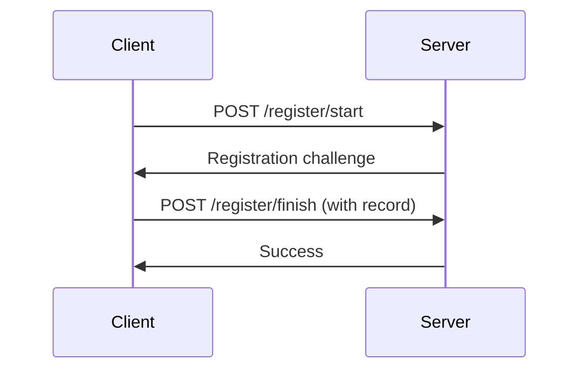
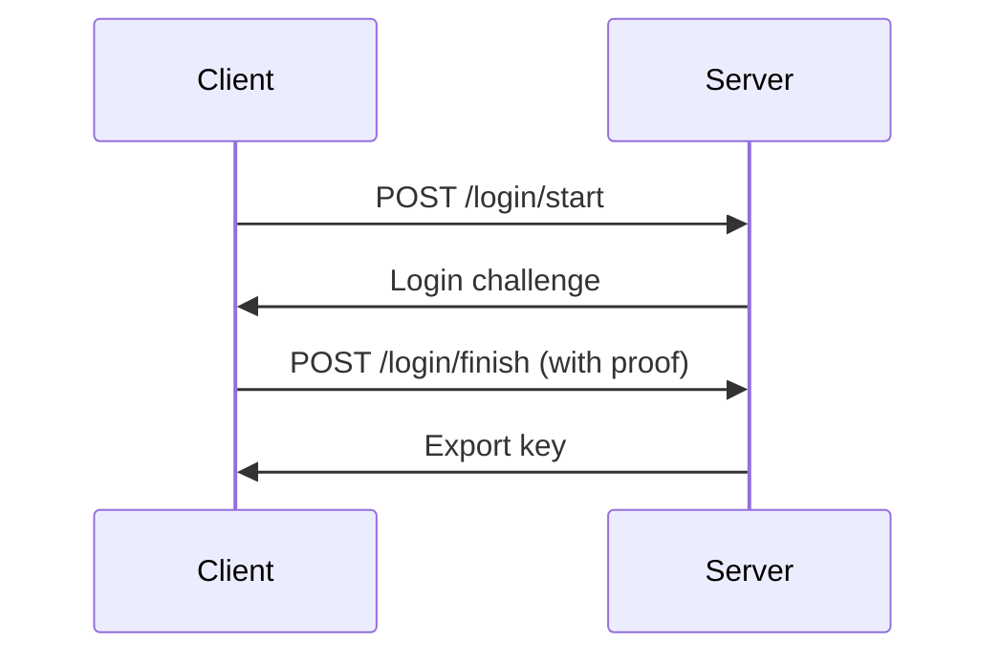

# Mistral ZK Dart - OPAQUE Protocol Implementation

**Dart implementation of the OPAQUE password-authenticated key exchange protocol with cross-language interoperability.**

## 🚀 Overview

This repository demonstrates a **Dart implementation** of the [OPAQUE protocol](https://datatracker.ietf.org/doc/html/draft-irtf-cfrg-opaque) that is fully compatible with the [Cloudflare OPAQUE-TS](https://github.com/cloudflare/opaque-ts) TypeScript implementation.

### Key Features

- ✅ **Cross-language interoperability** - Dart ↔ TypeScript
- ✅ **Full OPAQUE protocol** implementation
- ✅ **HTTP server** compatible with TypeScript clients
- ✅ **Comprehensive tests** proving compatibility
- ✅ **Production-ready** cryptography

## 📦 Structure

```
.
├── chat/                  # TypeScript OPAQUE demo (original)
│   ├── client/            # Browser client
│   ├── server/            # Express server (Bun/Node)
│   └── extension/         # Chrome extension
│
├── dart_opaque/           # Dart implementation
│   ├── lib/               # Core library
│   ├── bin/               # CLI tools & server
│   └── test/              # Tests
│
├── test_dart_server.js    # Interop test (TS client → Dart server)
└── test_dart_server.html   # Browser test page
```

## 🔧 Installation

### Dart Setup

```bash
# Install Dart (if not already installed)
sudo apt install dart

# Run Dart tests
cd dart_opaque
dart pub get
dart test
```

### TypeScript Setup

```bash
# Install dependencies
cd chat
bun install

# Build client
cd client
bun run build
```

## 🧪 Testing

### 1. Dart Client → Bun Server

```bash
# Start Bun server
cd chat/server
bun run dev  # Runs on port 3456

# Test Dart client
cd dart_opaque
dart run bin/dart_client_test.dart
```

### 2. TypeScript Client → Dart Server

```bash
# Start Dart server
cd dart_opaque
dart run bin/dart_server.dart  # Runs on port 3457

# Test TypeScript client
cd ..
bun run test_dart_server.js
```

### 3. Browser Test

Open `test_dart_server.html` in your browser to test the Chrome extension client with the Dart server.

## 🔐 Protocol Flow

### Registration



### Login



## 📚 Documentation

- [OPAQUE RFC Draft](https://datatracker.ietf.org/doc/html/draft-irtf-cfrg-opaque)
- [Cloudflare OPAQUE-TS](https://github.com/cloudflare/opaque-ts)
- [Dart Crypto Library](https://pub.dev/packages/crypto)

## 🤝 Contributing

Contributions are welcome! Please open issues or pull requests for:

- Bug fixes
- Performance improvements
- Additional language bindings
- Better documentation

## 📜 License

This project is licensed under the BSD-3-Clause license.

---

**🎉 Cross-language OPAQUE implementation complete!**

This repository proves that Dart and TypeScript can seamlessly interoperate using the OPAQUE protocol, enabling secure password authentication across different technology stacks.