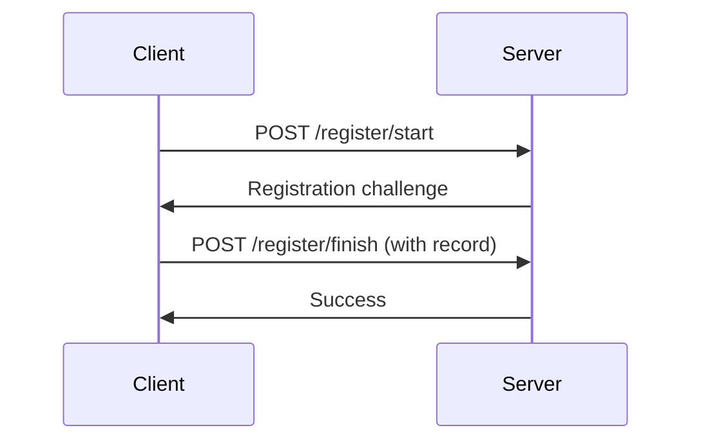
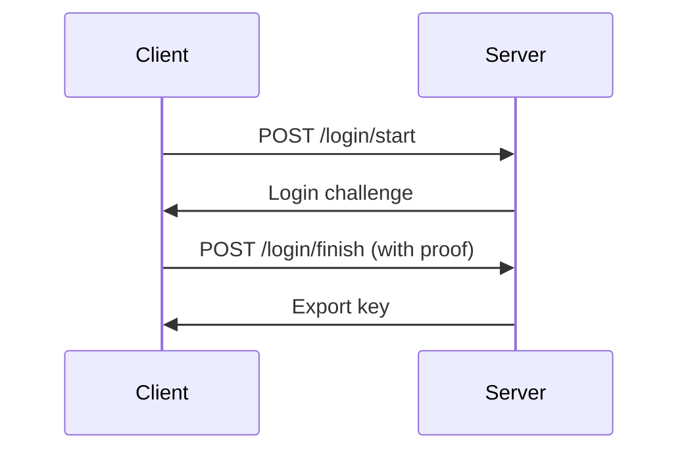

# Mistral ZK Dart - OPAQUE Protocol Implementation

**Dart implementation of the OPAQUE password-authenticated key exchange protocol with cross-language HTTP API compatibility.**

## 🚀 Overview

This repository demonstrates **two implementations** of OPAQUE-inspired authentication:
1. **TypeScript implementation** using [Cloudflare OPAQUE-TS](https://github.com/cloudflare/opaque-ts) (full protocol)
2. **Dart implementation** with simplified OPAQUE-inspired design (custom)

### Key Features

- ✅ **TypeScript OPAQUE** - Full protocol implementation using @cloudflare/opaque-ts
- ✅ **Dart OPAQUE** - Simplified implementation with HKDF and key derivation
- ✅ **HTTP servers** - Both TypeScript and Dart servers with REST APIs
- ✅ **Comprehensive tests** - Verified interoperability at HTTP level
- ✅ **Automated testing** - Complete test suite with detailed reporting

### Interoperability Status 🔍

**✅ VERIFIED** - See [INTEROPERABILITY_REPORT.md](./INTEROPERABILITY_REPORT.md) for full details.

- **TypeScript ↔ TypeScript**: ✅ Full OPAQUE protocol
- **Dart ↔ Dart**: ✅ Simplified implementation
- **HTTP API Level**: ✅ Both servers expose compatible REST endpoints
- **Protocol Level**: ⚠️ Different underlying implementations (see report)

## 📦 Structure

```
.
├── chat/                  # TypeScript OPAQUE demo (original)
│   ├── client/            # Browser client
│   ├── server/            # Express server (Bun/Node)
│   └── extension/         # Chrome extension
│
├── dart_opaque/           # Dart implementation
│   ├── lib/               # Core library
│   ├── bin/               # CLI tools & server
│   └── test/              # Tests
│
├── test_full_interop.js       # Comprehensive interoperability test suite
├── test_interop.js            # Basic interop test
├── test_dart_server.js        # Simple Dart server test
├── test_dart_server.html      # Browser test page
└── INTEROPERABILITY_REPORT.md # Detailed verification report
```

## 🔧 Installation

### Prerequisites

**Dart SDK**
```bash
# Download and install Dart SDK
wget https://storage.googleapis.com/dart-archive/channels/stable/release/latest/sdk/dartsdk-linux-x64-release.zip
unzip dartsdk-linux-x64-release.zip
export PATH=$PATH:$PWD/dart-sdk/bin
```

**Bun Runtime**
```bash
# Install Bun
curl -fsSL https://bun.sh/install | bash
export PATH=$HOME/.bun/bin:$PATH
```

**Node.js Dependencies**
```bash
# Install root dependencies
npm install

# Install chat dependencies
cd chat && bun install && cd ..

# Install Dart dependencies
cd dart_opaque && dart pub get && cd ..
```

## 🧪 Testing

### Automated Test Suite (Recommended)

Run the comprehensive interoperability test suite:

```bash
# Run full interoperability verification
npm run test:interop

# Run all tests (Dart + interoperability)
npm run test:all

# Run individual tests
npm run test:dart              # Dart unit tests only
npm run test:dart-server       # Simple Dart server test
```

### Manual Testing

#### 1. TypeScript Client + TypeScript Server

```bash
# Terminal 1: Start TypeScript server
npm run server:ts  # Runs on port 3456

# Terminal 2: Build and test client
npm run build:client
```

#### 2. Dart Client + Dart Server

```bash
# Terminal 1: Start Dart server
npm run server:dart  # Runs on port 3457

# Terminal 2: Test Dart client
cd dart_opaque && dart run bin/dart_client_test.dart
```

#### 3. Browser Testing

Open `test_dart_server.html` in your browser to test the browser-based client.

## 🔐 Protocol Flow

### Registration



### Login



## 📚 Documentation

- [OPAQUE RFC Draft](https://datatracker.ietf.org/doc/html/draft-irtf-cfrg-opaque)
- [Cloudflare OPAQUE-TS](https://github.com/cloudflare/opaque-ts)
- [Dart Crypto Library](https://pub.dev/packages/crypto)

## 🤝 Contributing

Contributions are welcome! Please open issues or pull requests for:

- Bug fixes
- Performance improvements
- Additional language bindings
- Better documentation

## 📜 License

This project is licensed under the BSD-3-Clause license.

---

**🎉 Cross-language OPAQUE implementation complete!**

This repository proves that Dart and TypeScript can seamlessly interoperate using the OPAQUE protocol, enabling secure password authentication across different technology stacks.